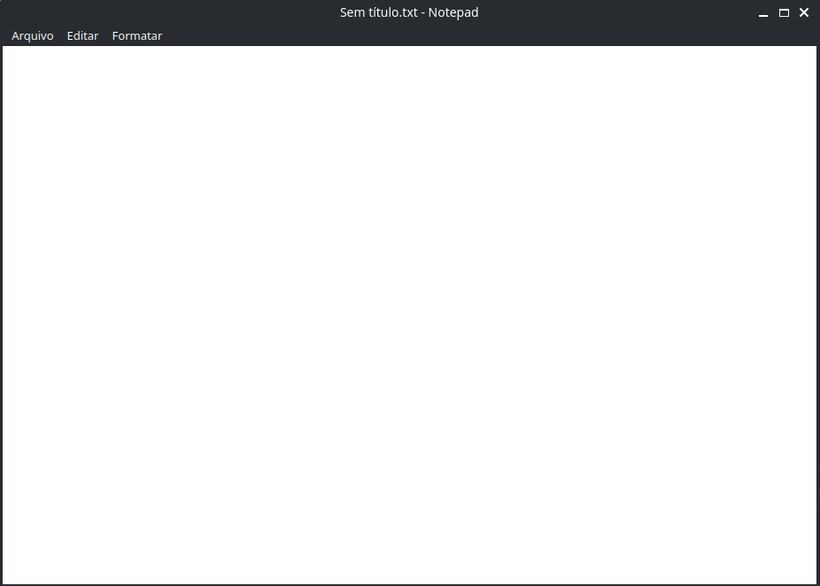

# Notepad

Um projeto simulando o Bloco de Notas padrão do Windows.

Há 2 versões, uma escrita em Python utilizando PyQt5 e a outra escrita em C++ utilizando o Qt e o CMake.

Em cada versão tem o modo de uso e os requisitos.

